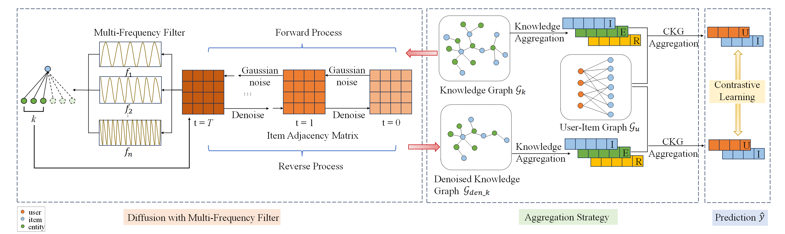

# Multi-Frequency Filter Based Denoising Diffusion Model for Knowledge-Aware Recommendation

This is the PyTorch implementation for **FDiff** proposed in the paper. 



## Environment

We develop our codes in the following environment:

- python==3.9.13
- numpy==1.23.1
- torch==1.11.0
- scipy==1.9.1

## Datasets

|                       |                | Last-FM   | MIND      | Alibaba-iFashion |
|-----------------------|----------------|-----------|-----------|------------------|
| User-Item Interaction | # Users        | 23,566    | 100,000   | 114,737          |
|                       | # Items        | 48,123    | 30,577    | 30,040           |
|                       | # Interactions | 3,034,796 | 2,975,319 | 1,781,093        |
|                       | # Density      | 2.7e-3    | 9.7e-4    | 5.2e-4           |
| Knowledge Graph       | # Entities     | 58,266    | 24,733    | 59,156           |
|                       | # Relations    | 9         | 512       | 51               |
|                       | # Triplets     | 464,567   | 148,568   | 279,155          |

## Run Codes

The command lines to train FDiff on the three datasets are as below. The un-specified hyperparameters in the commands are set as default.

- Last-FM

```python
python Main.py --data lastfm --reg 1e-5 --mess_dropout_rate 0.2 --layer_num_kg 2 --res_lambda 0 --triplet_num -1 --cl_pattern 1 --keepRate 0.1 --e_loss 0.01
```

- MIND

```python
python Main.py --data mind --e_loss 0.1 --temp 1 --ssl_reg 1 --mess_dropout_rate 0.2 --res_lambda 1
```

- Alibaba-iFashion

```python
python Main.py --data alibaba --reg 1e-6 --epoch 50 --ssl_reg 1 --temp 1
```
